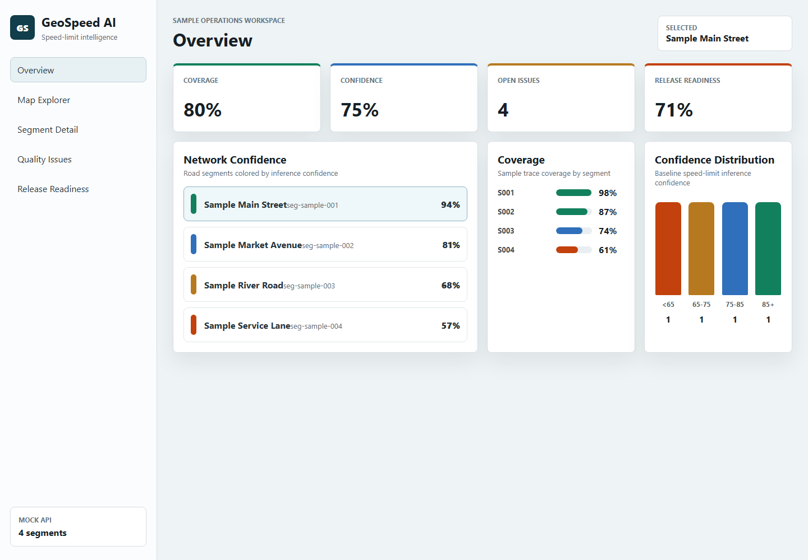
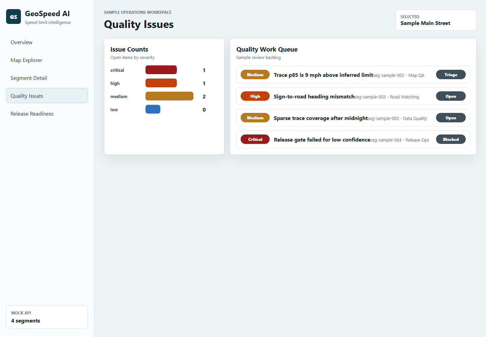

# GeoSpeed AI Platform

[](https://github.com/amini/geospeed-ai-platform/actions/workflows/ci.yml) [](LICENSE)

GeoSpeed AI Platform is a production-style geospatial AI and data-product monorepo for road speed-limit intelligence. It answers: what is the best available speed-limit value for each road segment, what evidence supports it, how confident are we, and is the segment ready for release into a production map-data product?

This project is a full-stack engineering showcase spanning Python pipelines, Java Spring Boot services, C++ matching logic, React + MapLibre dashboards, Docker Compose, and CI.

## Why This Matters

Speed-limit data powers navigation, routing, driver assistance, map freshness programs, and public-sector safety analysis. The hard part is not one model or one dataset; it is a product-quality system that combines authoritative sources, OSM tags, sign observations, observed-speed sanity checks, release rules, and human review.

## Architecture

```text
Open data / samples -> Python pipelines -> release candidate GeoJSON
                                      -> Java API -> React MapLibre dashboard
Traffic signs -------> C++ matcher ----^
Feature records -----> FastAPI ML baseline inference
```

## Tech Stack

- React, TypeScript, Vite, MapLibre GL JS
- Java 21, Spring Boot, Maven, OpenAPI
- Python, FastAPI, Pydantic, pytest-compatible typed modules
- C++17, CMake, GoogleTest
- Docker Compose, Kubernetes manifest stubs, GitHub Actions CI

## Data Sources

The first demo uses small checked-in sample files under `data/sample`. These are sample DC/NYC-style demo pipelines designed for public-data integration, not a claim that full jurisdiction-scale public datasets are currently bundled. The architecture is designed for later ingestion from:

- OpenStreetMap roads and `maxspeed` tags
- Overture Maps Transportation data
- Washington, DC open roadway and speed-limit data
- NYC open speed-limit and traffic-speed datasets
- Optional WSDOT, Caltrans PeMS, or Mapillary-compatible sign observations

No proprietary or paid data is required.

## Current Implementation Status

| Area | Status | Notes |
| --- | --- | --- |
| Web dashboard | Implemented | React, TypeScript, MapLibre, sample/open-data-compatible workflows |
| Auto head-unit simulator | Implemented | Route replay, speed-limit alerts, ADAS mismatch, partner debug panel |
| Java product API | Implemented | Spring Boot API with Maven and OpenAPI support |
| Partner integration API | Implemented | Partner scenarios, issues, triage, feature requests, launch readiness |
| Python ML service | Implemented | FastAPI baseline speed-limit inference and evaluation |
| Vehicle signals service | Implemented | FastAPI VSS-style simulated signal replay for simulator use |
| C++ matcher | Implemented | C++17 road/sign matching library and CLI |
| Pipelines | Implemented | Sample ingestion, release candidate generation, validation, report |
| Docker / CI | Implemented | Compose config validation, service tests/builds, pipeline smoke |

## Quick Start

```bash
make setup
make ingest-sample
make release-report
make test
```

Run the local stack:

```bash
make docker-up
```

Service URLs:

- Web dashboard: `http://localhost:5173`
- Auto head-unit simulator: `http://localhost:5174`
- Java API: `http://localhost:8080`
- Swagger UI: `http://localhost:8080/swagger-ui/index.html`
- Python ML service: `http://localhost:8000`
- Partner integration API: `http://localhost:8090/api/v1/partner/health`
- Vehicle signals API: `http://localhost:8010/health`

## Windows PowerShell

These helpers are intended for local Windows development when `make` is unavailable:

```powershell
.\scripts\setup.ps1
.\scripts\run-pipeline.ps1
.\scripts\test-all.ps1
```

They expect Node.js, Python, Docker, and a Java 21 JDK to be available on `PATH`. The Java test helper uses `mvn` when present and falls back to each service's `mvnw.cmd`.

## Demo Commands

```bash
python pipelines/ingest/ingest_osm_roads.py --input data/sample/roads.geojson --output data/sample/normalized_roads.json
python pipelines/transform/infer_speed_limits.py --segments data/sample/roads.geojson --speeds data/sample/speed_limits.geojson --signs data/sample/signs.geojson --observed data/sample/observed_speeds.csv --output data/sample/release_candidate.geojson
python pipelines/validate/generate_release_report.py --input data/sample/release_candidate.geojson --output data/sample/release_report.md
```

## API Examples

```bash
curl http://localhost:8080/api/v1/health
curl http://localhost:8080/api/v1/segments
curl http://localhost:8000/health
```

## Screenshots

### GeoSpeed Dashboard



### Partner Issue Triage



The auto head-unit simulator screenshot is pending capture and is not linked until the asset is available.

## Quality Policy Summary

A segment is release-ready only when confidence is at least `0.80`, freshness is at least `0.60`, conflict score is no more than `0.30`, at least one reliable evidence source exists, and no unresolved high-severity issue remains.

## ML / Inference Summary

The baseline inference engine prioritizes authoritative city or state speed-limit data, then OSM `maxspeed`, then high-confidence traffic sign observations. Road-class priors fill gaps. Observed vehicle speeds are validation signals only; they are never treated as legal speed limits.

## GeoSpeed Auto FDE Extension

GeoSpeed Auto FDE adds an open automotive partner-integration layer for Forward Deployed Engineering demos. It includes an in-vehicle head-unit simulator, partner issue triage API, launch-readiness workflow, COVESA VSS-style simulated vehicle signals, ADAS mismatch scenarios, and infotainment debug views.

The Auto FDE extension demonstrates automotive partner-integration workflows for speed-limit intelligence, in-vehicle navigation, ADAS validation, vehicle-signal replay, partner issue triage, and launch readiness using an open SDK-style simulator and public/sample data.

```text
Partner scenarios -> Vehicle Signals API -> Auto Head Unit Simulator
                 -> Partner Integration API -> Issue triage / launch readiness
                 -> GeoSpeed speed-limit quality data
```

Auto/FDE quick start:

```bash
make auto-up
make vehicle-signals
make partner-api
make auto-dashboard
make auto-test
make launch-readiness-report
```

## Roadmap

- MVP sample pipeline and dashboard
- Real open-data ingestion connectors
- Stronger sign-to-road matching and geometry indexing
- Model monitoring and evaluation reports
- Production storage, auth, observability, and deployment hardening
